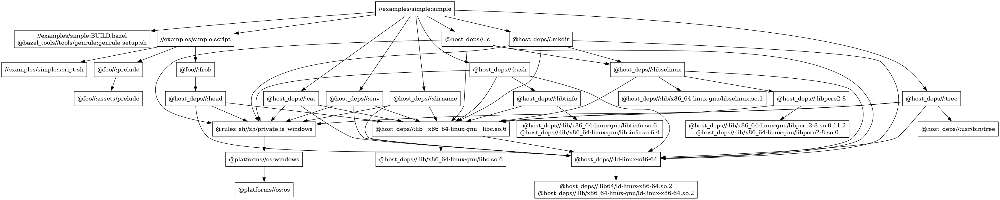

# Hermetic Sandbox in Practice
can we actually do "perfect" sandboxing?

<style>
html:not(.dark) .slidev-layout { background-color: #FFFFFF; }
html.dark       .slidev-layout { background-color: #789DBC; }
</style>


<v-click>

> Bazel is a build system for software development that attempts to create a hermetic build by bootstrapping the toolchain from known sources and binaries. Unfortunately, **the desire to be hermetic is more aspirational than exact**, and can run into some problems.
>
>
>  (https://nixos.wiki/wiki/Bazel )

</v-click>

<!--

  + great, we have the machinery -- what does usage look like
  + can we use existing rulesets? how burdensome is listing out deps?
  + practical thing to do is to carve out exemptions...
    * i.e. loader, shared objects, etc.
  + (pause)
  + but what if we didn't?
  + we took a different tack; asked the question: what if we didn't have any exemptions
    * what we actually did model all the dependencies used for every action, down to the system loader?
  + slightly out of paranoia but also out of curiosity: what would it take?
  + precedent in the ecosystem: took some inspiration from the nix ecosystem which does manage this level of hermeticity with its sandbox
    + on the slide is a quote about Bazel from the NixOS wiki actually, describing Bazel's approach to sandboxing as... aspirational

  + the answer, surprisingly? fairly attainable

I'll talk about the work required to actually get our build to work under this kind of strict sandboxing set up.

"Perfect" Sandboxing

-->

---

# Expressing Deps via `toolchain`s
the happy case

```python
load("@host_deps//:info.bzl", "get_label_for_binary_path")

# Python Toolchain:
py_runtime(
    name = "host_python3",
    stub_shebang = "#!{PYTHON_PATH}/bin/python{ver}".format(
        PYTHON_PATH = PYTHON_PATH,
        ver = PYTHON_VERSION,
    ),
    coverage_tool = None,
    files = [
        ":bin", ":stdlib", ":lib", ":dylib_deps_for_python", # filegroups
        get_label_for_binary_path(PYTHON_PATH),              # shared object info
    ],
    interpreter = ":bin/python3",
    python_version = "PY3",
)
py_runtime_pair(
    name = "host_python_toolchain",
    py3_runtime = ":host_python3",
    py2_runtime = None,
)
```

<!-- toolchains are our friend here; nice extension point to go and specify these machine-specific dependencies

python interpreter example

upside to toolchains is: not intrusive; lets you use existing rules and targets as is
  - assuming that they don't have implicit system dependencies of course
-->

---
layout: two-cols-header
---

# Latent Dependency Graph: _Shared Objects_

::left::

```console
$ lddtree /bin/ls -a
/bin/ls (interp: /lib64/ld-linux-x86-64.so.2)
 libselinux.so.1 => $LIB64/libselinux.so.1
  libpcre2-8.so.0 => $LIB64/libpcre2-8.so.0
   libc.so.6 => $LIB64/libc.so.6
  libc.so.6 => $LIB64/libc.so.6
 ld-linux-x86-64.so.2
 libc.so.6 => $LIB64/libc.so.6
```

```python
# host_deps_info.bzl (-> `update_shared_libs.py`)
EXTRA_BINARIES = [
  "/usr/bin/clang++-18",
  "/usr/bin/tree",
] + [
  "/bin/{}".format(name) for name in [
    "awk", "basename", "cat", ... ]]
```

<pre class="terminal shiki vitesse-dark vitesse-light slidev-code" style="font-size:0.8em"><code class="language-bash">$ bazel run @host_deps//:regenerate
<font color="#26A269">info</font>: processing file at `/bin/bash`
<font color="#26A269">info</font>: processing file at `/usr/bin/clang++-18`
<font color="#26A269">info</font>: processing file at `/usr/bin/tree`
<font color="#26A269">info</font>: processing file at `/bin/awk`
<font color="#26A269">info</font>: extracting preserved section from: <font color="#12488B">host_deps_info.bzl</font>
Wrote out to <font color="#12488B">`/workarea/deps/host_libs/host_deps_info.bzl`</font>
</code></pre>

::right::

```python
# host_deps_info.bzl (output)
def define_targets(filegroup, sh_binary):
  filegroup( ### Libraries:
    name = "ld-linux-x86-64",
    srcs = [":lib/x86_64-linux-gnu/ld-linux-x86-64.so.2"] + [
      ":lib64/ld-linux-x86-64.so.2"]) # Symlink
  # <snipped>
  sh_binary( ### Binaries:
    name = "bash",
    srcs = [":bin/bash"],
    data = [
      ":libtinfo", # `libtinfo.so.6` as `/lib/x86_64-linux-gnu/..
      ":lib__x86_64-linux-gnu__libc.so.6", # `libc.so.6` as ...
      ":ld-linux-x86-64", # `ld-linux-x86-64.so.2` as ...
    ])
```

```python {2,5-6}
# examples/simple/BUILD.bazel
load("@host_deps//:info.bzl", "get_label_for_binary_path")
genrule(
  name = "simple", ..., tools = [
    get_label_for_binary_path("/bin/bash"),
    get_label_for_binary_path("/bin/env"), ...
  ],
)
```

<!-- from here on out getting things to work under this strict sandboxing mode is pretty much an exercise in finding implicit dependencies in the Bazel ecosystem

I'll talk about a few of the bigger ones

Shared Objects are the biggest

shadow binary graph behind a lot of the binaries we run

painful to model by hand... fortunately: very amenable to automation

usage is also simple; here's our genrule as an example; letting us declare deps on bash and other POSIX binaries we require
  - in practice: macros to make this less painful, just include all POSIX binaries but keeping it simple for the sake of this example

leads nicely into our next set of common implicit dependencies:
-->

---
layout: two-cols
---

# Implicit Shell/POSIX Deps

--

common sources of shell dependencies:
  - `genrule`, `ctx.actions.run_shell`

implicit reliance on POSIX binaries on `$PATH`:
  - test setup script (every `_test` rule)
  - ... other helper scripts in rules

solutions:
  - today: wrapper macros, overrides implicit attrs
  - `label_flag`s in `@bazel_tools` → easy overriding
  - even better: toolchains for these deps:
    + `sh_toolchain` (`rules_shell`)
    + `rules_sh` for POSIX binaries

::right::

```python
# deps/test/BUILD.bazel
wrap_with_deps(
    name = "test_setup",
    inner = "@bazel_tools//tools/test:test-setup.sh",
    posix_bins = [ "mkdir", "dirname", "grep", ... ],
    ...
)
# ...
```

```python
# deps/test/defs.bzl
def test_tool_attrs(): return {
    "$test_runtime": [Label(":runtime")],
    "$test_setup_script": Label(":test_setup"),
    # ...
}
```

```python
# rules/python/defs.bzl
load("//deps/test:defs.bzl", "test_tool_attrs")
load("@rules_python//python:defs.bzl",
  _py_test = "py_test", ...)

def py_test(name, **kw_args):
    _py_test(
        name = name,
        **(kw_args | test_tool_attrs()),
    )
```

<!-- `rules_shell` `sh_toolchain` -->

---
layout: two-cols-header
---

# Latent Dependency Graph: Language Packages
interpreted languages: python, perl, ruby, etc.

  - wanted to expose system package installations but in a granular fashion
    + motivation here is the static graph information mostly
  - created repo rules to map out dependency edges between packages

::left::

```python
PYTHON_LIBRARY_DEPS = [
    PyDep("Mako", "1.2.4", deps = ["MarkupSafe"]),
    PyDep("MarkupSafe", "2.1.1"),
    PyDep("ruamel.yaml", "0.17.21"),
    PyDep("ruamel.yaml.clib", "0.2.7",
        shared_objects = ["_ruamel_yaml"]),
    PyDep("pyelftools", "0.29"),
    FetchedPyDep("lddtree", "1.3.7", deps = ["pyelftools"],
        fetch_info = fetchers.file(
          url = "https://.../v{VERSION}/lddtree.py",
          integrity = "sha256-...",
    )),
    FetchedPyDep("pathspec", "0.12.1",
        fetch_info = fetchers.pypi_whl(integrity = "...")),
    ...
]
```

::right::

```python
load("//rules/python:defs.bzl",
  "py_binary", "py_requirement"
)

py_binary(
    name = "foo",
    deps = [
        py_requirement("Mako"),
        py_requirement("ruamel.yaml"),
        py_requirement("yamllint"),
    ],
    ...
)
```

<!--

perhaps a bit specific to our use case: locked into using global installations for interpreters like Perl, Python, Ruby, etc. due to packages that they have installed that we cannot easily install ourselves "locally"

desire to still have users list out package deps instead of just having access to everything from the system installation
  + motivation here is the static graph information mostly

repo rule to figure out what the files corresponding to each package are, sets up filegroups and dependency edges accordingly
-->

---
transition: fade-out
---

# Extra Upsides

  - strong correctness guarantees
    + eliminates "worked on my machine because I had `/usr/bin/<whatever>` installed"
    + mismatches in system libraries/tools cannot cause _correctness_ issues
  - extra information in the static build graph: deps on binaries, libraries, language packages; can answer:
    * "who is still using `libtinfo5.so`?"
    * "I want to update `pyyaml`; what to test?"
    * "is `/usr/bin/frob` used in the build?"
  - good incremental tool cleanup story; model without fear



<!-- speaker notes -->
